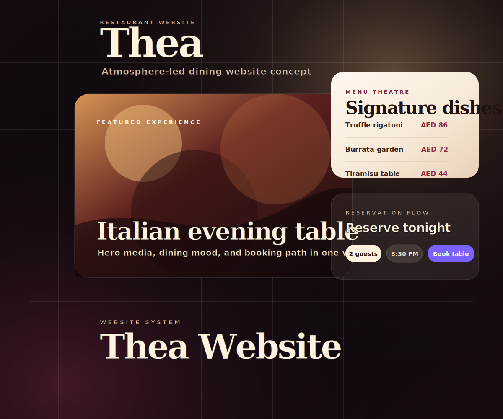

# Thea Restaurant Website

A premium restaurant website case study focused on hospitality positioning, visual hierarchy, menu confidence, reservation intent, and responsive frontend execution.

This public repo is a recruiter-facing case study. The private prototype/source is not published here.

## Recruiter Signal

- Translates hospitality research into a polished web direction.
- Shows understanding of restaurant conversion paths: atmosphere, menu, proof, reservation.
- Balances visual storytelling with practical user tasks.
- Keeps public presentation clean without implying official ownership.

## Project Snapshot

| Area | Detail |
|---|---|
| Role | Research, visual direction, frontend prototype |
| Domain | Premium restaurant / F&B website |
| Stack | React, Vite, CSS, motion direction, public research |
| Status | Private prototype; public case study |

## What I Focused On

- First-screen brand impression.
- Menu and signature-item structure.
- Reservation/enquiry flow design.
- Review and social-proof framing.
- Responsive visual system for mobile and desktop.

## Public Boundary

This is presented as a concept/prototype case study. Live venue links, contact routing, QA captures, logs, tunnels, and implementation source are not published.

## Read More

- [Case Study](docs/case-study.md)
- [UX Notes](docs/architecture.md)
- [Validation Summary](docs/validation.md)
